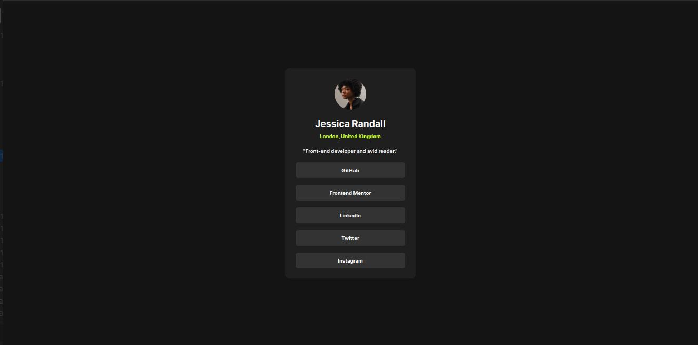

# Frontend Mentor - Social links profile solution

This is a solution to the [Social links profile challenge on Frontend Mentor](https://www.frontendmentor.io/challenges/social-links-profile-UG32l9m6dQ). Frontend Mentor challenges help you improve your coding skills by building realistic projects.

## Table of contents

- [Overview](#overview)
  - [The challenge](#the-challenge)
  - [Screenshot](#screenshot)
  - [Links](#links)
- [My process](#my-process)
  - [Built with](#built-with)
  - [What I learned](#what-i-learned)
  - [Continued development](#continued-development)
  - [Useful resources](#useful-resources)
- [Author](#author)
- [Acknowledgments](#acknowledgments)

## Overview

### The challenge

Users should be able to:

- See hover and focus states for all interactive elements on the page

### Screenshot



### Links

- Solution URL: [https://github.com/ababaug/social-links-profile-main]
- Live Site URL: [https://ababaug.github.io/social-links-profile-main/]

## My process

### Built with

- Semantic HTML5 markup
- CSS custom properties
- Flexbox
- Mobile-first workflow

**Note: These are just examples. Delete this note and replace the list above with your own choices**

### What I learned

Use this section to recap over some of your major learnings while working through this project. Writing these out and providing code samples of areas you want to highlight is a great way to reinforce your own knowledge.

To see how you can add code snippets, see below:

```html
<body>
  <main class="container">
    <div class="img">
      
    </div>
    <div class="info">
      <h1>Jessica Randall <br /><span>London, United Kingdom</span></h1>
      <p>"Front-end developer and avid reader."</p>
    </div>
    <div class="social">
      <ul>
        <li>
          <div>GitHub</div>
        </li>
        <li>
          <div>Frontend Mentor</div>
        </li>
        <li>
          <div>LinkedIn</div>
        </li>
        <li>
          <div>Twitter</div>
        </li>
        <li>
          <div>Instagram</div>
        </li>
      </ul>
    </div>
  </main>
</body>
```

```css
@font-face {
  font-family: Inter;
  src: url(assets/fonts/Inter-VariableFont_slnt\wght.ttf);
}

@font-face {
  font-family: Inter-bold;
  src: url(assets/fonts/static/Inter-Bold.ttf);
}

@font-face {
  font-family: Inter-regular;
  src: url(assets/fonts/static/Inter-Regular.ttf);
}

@font-face {
  font-family: Inter-semi;
  src: url(assets/fonts/static/Inter-SemiBold.ttf);
}

* {
  box-sizing: border-box;
  margin: 0;
  padding: 0;
}

body {
  background-color: #141414;
  color: #fcfcfc;
  display: flex;
  justify-content: center;
  align-items: center;
  overflow: hidden;
  height: 100vh;
}

.container {
  background-color: #1f1f1f;
  display: flex;
  flex-direction: column;
  justify-content: space-between;
  align-items: center;
  border: 0;
  box-shadow: 5px 10px transparent;
  height: 491px;
  width: 291px;
  border-radius: 10px;
  padding: 20px 0;
}

.img {
  width: 75px;
  height: 75px;
}

.img img {
  width: 100%;
  height: 100%;
  border-radius: 50%;
}

.info {
  display: flex;
  flex-direction: column;
  justify-content: space-between;
  align-items: center;
  height: 85px;
  text-align: center;
}

.info h1 {
  font-family: Inter-bold;
  font-size: 20px;
}

.info h1 span {
  font-family: Inter-bold;
  font-size: 12px;
  color: #88a240;
}

.info p {
  font-family: Inter-semi;
  font-size: 12px;
}

.social ul {
  list-style: none;
}

.social ul li div {
  font-family: Inter-bold;
  font-size: 12px;
  background-color: #333333;
  width: 250px;
  text-align: center;
  border: 0;
  border-radius: 6px;
  box-shadow: 5px 5px transparent;
  padding: 12px 0;
}

.social li:not(:last-child) {
  margin-bottom: 14px;
}

@media only screen and (min-width: 600px) {
  .social ul li div:hover {
    background-color: yellow;
    color: black;
    cursor: pointer;
  }
}
```

## Author

- Website - [https://www.linkedin.com/in/augustine-stephen-abah-51103090/]
- Frontend Mentor - [@ababaug](https://www.frontendmentor.io/profile/ababaug)
